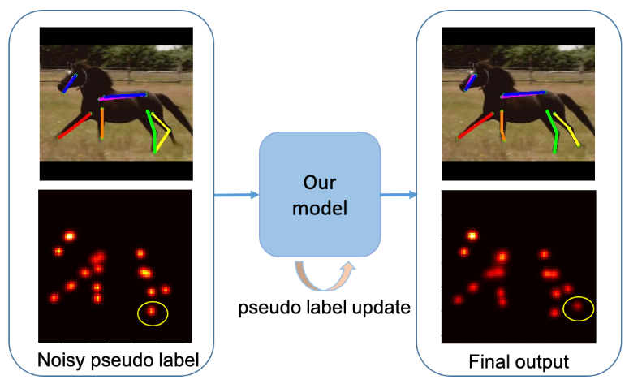
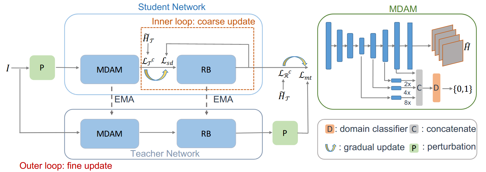

# UDA-Animal-Pose

**About**

This is the source code for our paper

Chen Li, Gim Hee Lee. From Synthetic to Real: Unsupervised Domain Adaptation for Animal Pose Estimation. In CVPR2021.

The pseudo labels generated from model trained on synthetic data are noisy, which leads to degraded performance when directly used for training. In this work, we propose an online coarse-to-fine pseudo label update strategy to gradually replace noisy pseudo labels with more accurate ones.

<p align="center">
  
</p>

Our network is a student-teacher architecture, where the student network consists of a multi-scale domain adaptation module(MDAM), a refinement block (RB) and a self-feedback loop. We conduct online coarse-to-fine pseudo label update through the inner loopand the outer loop, respectively.

<p align="center">
  
</p>

For more details, please refer to [our paper](https://arxiv.org/pdf/2103.14843.pdf).

**Bibtex**
```
@article{li2021synthetic,
  title={From Synthetic to Real: Unsupervised Domain Adaptation for Animal Pose Estimation},
  author={Li, Chen and Lee, Gim Hee},
  journal={arXiv preprint arXiv:2103.14843},
  year={2021}
}
```

**Dependencies**
1. Python 3.7.10
2. Pytorch 1.2.0

Please refer to requirements.txt for more details on dependencies.

**Download datasets**
* Clone this repository:

    ```
    git clone https://github.com/chaneyddtt/UDA-Animal-Pose.git
    ```
* Download the synthetic and real animal datasets according to [@JitengMu](https://github.com/JitengMu/Learning-from-Synthetic-Animals):

    * Create a symbolic link to the image directory of the animal datasets:
    ```
    ln -s PATH_TO_IMAGES_DIR ./animal_data
    ``` 
    * Download the TigDog dataset and move folder behaviorDiscovery2.0 to ./animal_data/.
    * Download synthetic animal dataset by running:
    ```
    bash get_dataset.sh
    ```
* Download the Pascal VOC dataset and move folder to ./animal_data/:
    ```
    wget http://host.robots.ox.ac.uk/pascal/VOC/voc2012/VOCtrainval_11-May-2012.tar
    tar -xf VOCtrainval_11-May-2012.tar
    ```
    
**Data Preprocess**
* Download keypoints for [synthetic data](https://drive.google.com/file/d/1jpGD235mFsVixeVRpcqMzGcbXqUtOvAy/view?usp=sharing), which only includes 18 keypoints used in the paper. This is for faster data loading. Or you can generate by yourself by running:
    ```
    python pose/datasets/synthetic_animal_sp_all.py
    ```
    Put the the folder clean_data to ./animal_data/.
* Download the [cropped images](https://drive.google.com/file/d/1qFX_H2o8_unFpADowjTOcGfr_SwKkuYg/view?usp=sharing) for the TigDog dataset and move the folder real_animal_crop_v4 to ./animal_data/, or you can generate by yourself by running:
    ```
    python get_cropped_TigDog.py
    ```
 **Train**
 
 If you do not want to train from scratch, you can download our [pretrained model](https://drive.google.com/file/d/1T1LRLL7c122gUPyCclLSXqNxtU8otkF8/view?usp=sharing) trained on the synthetic data (stage1), as well as the [pseudo labels](https://drive.google.com/file/d/1a8-r9EWQ1IKnbcwDTYn4TVwEm9yDINXI/view?usp=sharing) generated by this model.  Move the folder psudo_labels to ./animal_data/ and move the pretrained model to ./checkpoint/all/. The pretrained model achieve a PCK@0.05 of 64.71 on the real animal dataset. Train our model by running:
```
CUDA_VISIBLE_DEVICES=0 python train/train_refinenet_mt.py --arch pose_resnet_refine_mt_multida --checkpoint ./checkpoint       /all/syn2real_refinenet_mt --dual_branch --mixup_dual --dataset_real_crop real_animal_crop_all --occlusion_aug --pretrained ./checkpoint/all/models/stage1/model_best.pth.tar --animal all --dataset_real real_animal_all --dataset synthetic_animal_sp_all --train_on_all_cat
```
 
You can also train from scratch. Firstly, You will train the model on the synthetic dataset by running:
```
CUDA_VISIBLE_DEVICES=0 python train/train_refinenet.py --arch pose_resnet_refine --checkpoint ./checkpoint/all/syn_refinenet --animal all --solver adam --dataset synthetic_animal_sp_all --dataset_real real_animal_all --train_on_all_cat
```

Then you can generate pseudo labels with this model and train with both synthetic and real data by running:
```
CUDA_VISIBLE_DEVICES=0 python train/train_refinenet_mt.py --arch pose_resnet_refine_mt_multida --checkpoint ./checkpoint/all/syn2real_refinenet_mt --dual_branch --mixup_dual --dataset_real_crop real_animal_crop_all --occlusion_aug --pretrained ./checkpoint/all/syn_refinenet/model_best.pth.tar --animal all --dataset_real real_animal_all --dataset synthetic_animal_sp_all --train_on_all_cat --generate_pseudol
```

**Test**

Download our [model](https://drive.google.com/file/d/1T1LRLL7c122gUPyCclLSXqNxtU8otkF8/view?usp=sharing) and test on the TigDog by running:
```
CUDA_VISIBLE_DEVICES=0 python evaluation/test.py --arch pose_resnet_refine_mt_multida --animal all --dataset real_animal_all --resume checkpoint/all/models/stage2/model_best.pth.tar --evaluate --train_on_all_cat --flip
```
This will compute the average PCK score for both horse and tiger, and you can set '--animal' to horse or tiger to get the PCK score for each animal category.

**Acknowledgements**

Thanks [@JitengMu](https://github.com/JitengMu/Learning-from-Synthetic-Animals) for his quick response when I have questions about his [interesting paper](https://arxiv.org/pdf/1912.08265.pdf). If you use the synthetic dataset, please cite
```
@InProceedings{Mu_2020_CVPR,
author = {Mu, Jiteng and Qiu, Weichao and Hager, Gregory D. and Yuille, Alan L.},
title = {Learning From Synthetic Animals},
booktitle = {IEEE/CVF Conference on Computer Vision and Pattern Recognition (CVPR)},
month = {June},
year = {2020}
}
```

